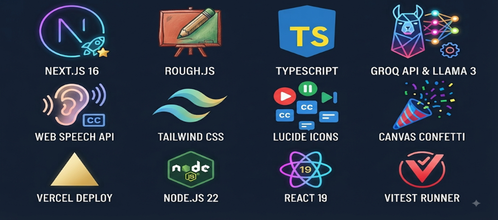

# BoardLogic — AI Whiteboard Explainer Video Platform

Useful videos that teach, describe, and explain concepts step-by-step.

---

## 📌 Problem Statement

Traditional explainer video creation is a tedious, multi-step bottleneck:
- **High Production Costs**: Designing assets, writing scripts, recording voiceovers, and editing timelines manually is expensive and time-consuming.
- **Cinematic Bias in AI**: Existing AI video generators are trained for short cinematic clips, camera angles, and dramatic lighting. They fail at structured, step-by-step visual explanations (like explaining how a database clusters, or how stablecoin reserves are checked).
- **The Sync Struggle**: Coordinating animation cues, narration cadences, and subtitles manually requires complex keyframing.

---

## 💡 The Solution

**BoardLogic** is a deterministic whiteboard video generator that turns simple prompts into polished, hand-drawn explainer flows. It utilizes a multi-agent Visual Director and scriptwriter workflow:
1. **Logical Visual Flows**: Converts complex explanations into a horizontal process map using vector models.
2. **Hand-Drawn Aesthetic**: Renders diagrams in real-time using `Rough.js` to create a natural whiteboard sketch look (complete with graph paper and chalkboard presets).
3. **Synchronized Soothing Voice**: Synchronizes voice boundary transitions with in-canvas drawings and closed captions.

---

## 🎨 Core Features

### 1. Visual Director Engine
- **Horizontal 4-Node Layouts**: Positions nodes chronologically left-to-right (`x=40` to `x=610`) inside the canvas, optimizing reading flow.
- **Circular Pastel Spots**: Places colored spot highlights behind models to establish modern design aesthetics.
- **62 Hand-Drawn Doodle Models**: Built-in library representing technology (database, chip, blockchain), finance (wallet, money), science (atom, wave), people, and tools.
- **Hand-drawn Connectors**: Draws blue arrows with customized action pill badges (*"LOCK COLLATERAL"*, *"VERIFIES RESERVES"*) above them.

### 2. Audio & Closed Caption Synchronization
- **Word-Aligned Narrative Sync**: Breaks narration into per-step transcript entries and advances step-by-step as each narration sentence finishes speaking.
- **Soothing Cadence Cache**: Filters for low-cadence, calming voice profiles (like `Google US English`, `Natural`, `Samantha`) and locks the selection on startup to prevent mid-video voice changes.
- **Dynamic Mute Fallback**: Safely switches to a 4-second step-advancement timer if the video is muted or browser audio is blocked, then seamlessly resumes speech if unmuted mid-play.

### 3. Professional Media Controls
- **Scrubbable Progress Bar**: Click anywhere on the timeline progress slider to scrub/seek directly to that step.
- **Skip Back & Forward**: Next/Previous buttons allow users to step backward or forward through explanations.
- **Elapsed Timeline**: Shows actual elapsed and remaining time in seconds (e.g. `0:04 / 0:16 (12s left)`).

---

## 🛠️ Tech Stack



---

## 🏗️ Project Architecture

```bash
d:\BoardLogic\
├── src/
│   ├── app/
│   │   ├── api/generate-scene/route.ts  # Groq API scene planner & scriptwriter endpoint
│   │   ├── studio/page.tsx               # Studio suite with scrubber & full-width script panel
│   │   ├── page.tsx                      # Landing showcase with interactive demo player
│   │   ├── globals.css                   # Custom styles, graph paper grids, and chalkboard styles
│   │   └── layout.tsx                    # Next.js root layout
│   ├── components/
│   │   ├── RoughCanvas.tsx               # Layered Rough.js canvas drawing engine (35+ doodles)
│   │   └── IconLibrary.tsx               # Vector app logo component
│   └── lib/
│       └── boardLogicEngine.ts           # Types, presets, voice synthesizer, and keyword mappings
├── package.json
└── tsconfig.json
```

---

## ⚙️ Getting Started

### 1. Environment Configuration
Create a `.env.local` file in the root directory and add your Groq API key:
```env
GROQ_API_KEY=your_groq_api_key_here
```

### 2. Install Dependencies
```bash
npm install
```

### 3. Run Development Server
```bash
npm run dev
```
Open [http://localhost:3000](http://localhost:3000) for the landing showcase, or [http://localhost:3000/studio](http://localhost:3000/studio) for the video generator studio.

### 4. Build Production Bundle
```bash
npm run build
```

---

## 🤝 Verification Guidelines
- **Canvas Dimensions**: The layout coordinate system is strictly bounded to `800`x`450` (scaled dynamically on high-DPI displays).
- **TypeScript Compliance**: Strictly typed connection and node schemas (`SceneDefinition`, `WhiteboardNode`).
